# Workflow - Luồng Xử Lý Chức Năng

## Tổng Quan Các Workflow

| ID | Workflow | Mô tả |
|----|----------|-------|
| WF01 | Đăng nhập | Vào chương trình |
| WF02 | Thêm tàu chờ | Thêm tàu mới vào danh sách chờ |
| WF03 | Cập cầu tàu | Kéo thả từ waiting list vào grid |
| WF04 | Di chuyển tàu | Thay đổi vị trí tàu trên grid |
| WF05 | Chỉnh sửa thông tin | Sửa chi tiết tàu |
| WF06 | Chuyển về chờ | Từ grid về waiting list |
| WF07 | Xóa tàu | Xóa khỏi kế hoạch |
| WF08 | Import Excel | Nhập dữ liệu từ Excel |
| WF09 | Export | Xuất kế hoạch (JSON/PDF/Report) |
| WF10 | Lưu/Mở kế hoạch | Save/Load file JSON |

---

## WF01: Đăng Nhập

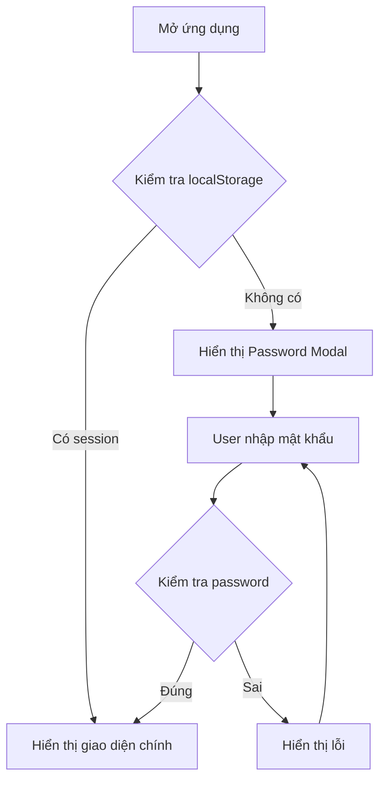

**Chi tiết:**
1. App render → kiểm tra state trong localStorage
2. Nếu chưa đăng nhập → hiện Password Modal
3. User nhập password → so sánh với stored password (default: "HoangTT@2025")
4. Đúng → set state `showPasswordModal = false` → hiển thị main UI
5. Password được lưu/đọc từ localStorage với key `plannerPassword`

---

## WF02: Thêm Tàu Chờ (Tạo Tàu Mới)

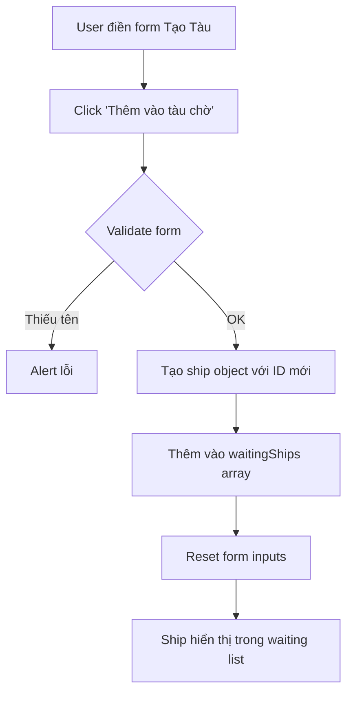

**Fields bắt buộc:** Tên tàu

**Fields tùy chọn:** IMO, DWT, LOA, BEAM, Loại hàng, Số lượng

**Giá trị mặc định:**
- DWT: 1000
- LOA: 100m
- BEAM: 20m
- ID: `"W" + Date.now()`

---

## WF03: Cập Cầu Tàu (Drag & Drop từ Waiting List)

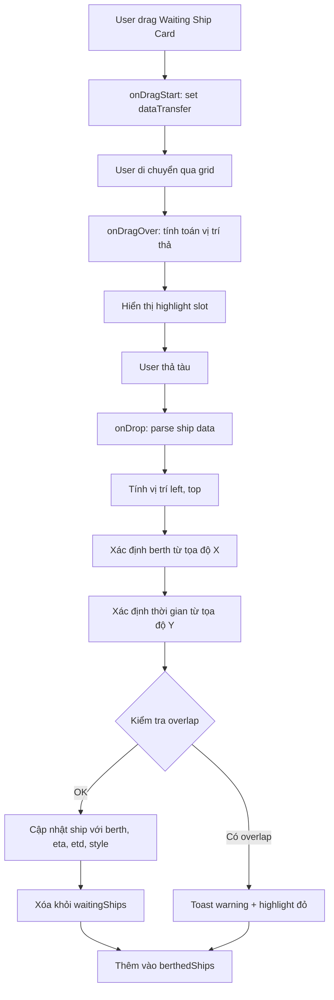

**Logic tính vị trí:**
1. `left` được tính theo thước đo 1005m (tổng chiều dài)
2. `top` được tính: `(slotIndex) * 30px`
3. Snap to slot: làm tròn về đầu slot gần nhất

**Xác định berth từ X:**
- 0-199: K12C
- 229-361: K12A
- 361-549: K12
- 549-753: K12B
- 773-995: TT2
- Vị trí gap: không cho phép thả

---

## WF04: Di Chuyển Tàu Trên Grid

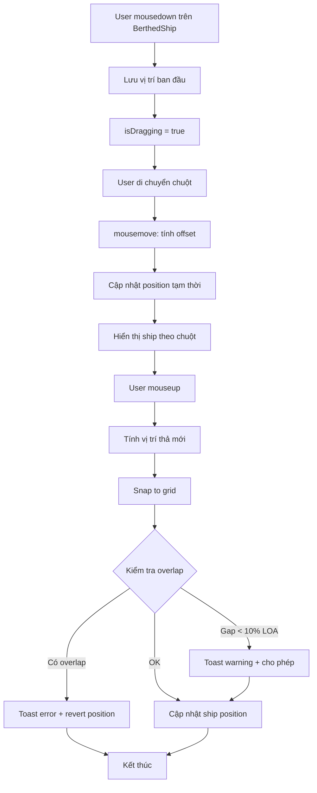

**Snap Logic:**
- Horizontal: Snap theo mốc mét (1m = 1 đơn vị)
- Vertical: Snap theo slot 30px (1 slot = 12 giờ)

---

## WF05: Chỉnh Sửa Thông Tin Tàu

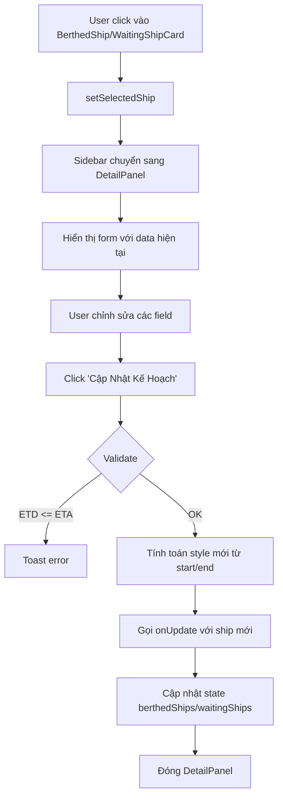

**Tự động tính toán:**
- Thay đổi `start` → `end = start + LOA`
- Thay đổi `end` → `start = end - LOA`
- Thay đổi `LOA` → `end = start + LOA`
- Thay đổi `berthName` → reset `start` về vị trí đầu bến

---

## WF06: Chuyển Về Danh Sách Chờ

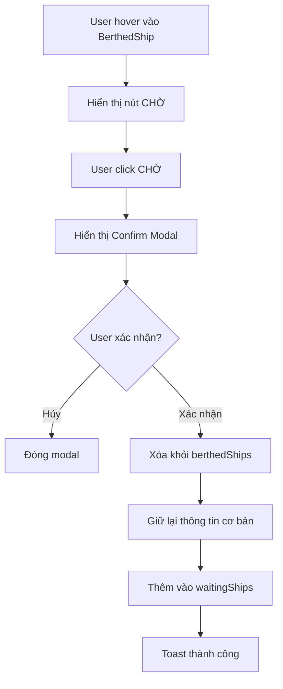

**Thông tin giữ lại:** id, name, dwt, loa, beam, cargoType, cargo, eta, etd, berthName, start, end

---

## WF07: Xóa Tàu Khỏi Kế Hoạch

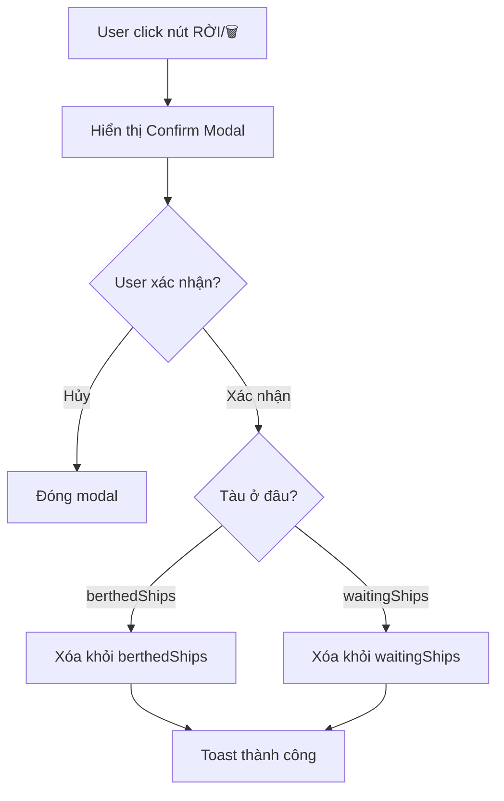

---

## WF08: Import Từ Excel

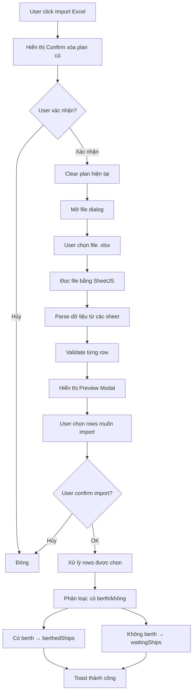

**Cột Excel mong đợi:**
- Tên tàu (name)
- DWT, LOA, BEAM
- Loại hàng (cargoType)
- Số lượng (cargo)
- Cầu bến (berthName)
- ETA, ETD
- Vị trí (start, end)

**Xử lý date:**
- Hỗ trợ nhiều format: ISO, DD/MM/YYYY, DD-MM-YYYY, Excel serial number

---

## WF09: Export

### WF09a: Export PDF

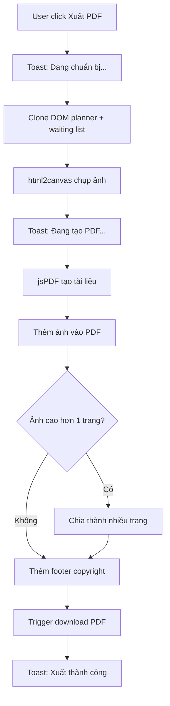

### WF09b: Export Báo Cáo Chi Tiết

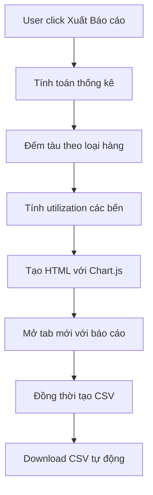

**Nội dung báo cáo:**
- Bảng danh sách tàu chi tiết
- Biểu đồ tròn: Số tàu theo loại hàng
- Biểu đồ cột: Khối lượng hàng theo loại
- Biểu đồ utilization các bến

---

## WF10: Lưu/Mở Kế Hoạch JSON

### WF10a: Lưu

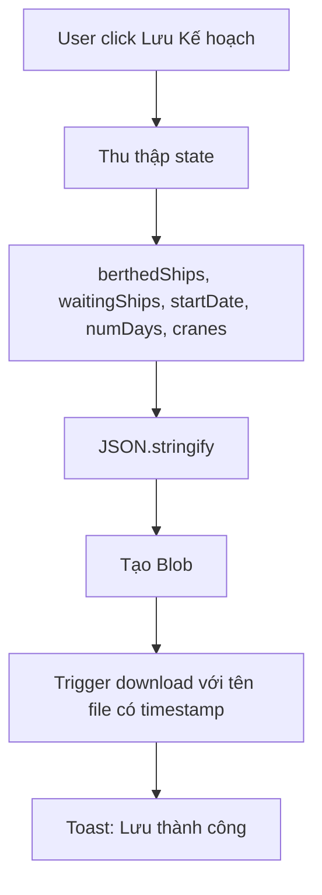

### WF10b: Mở

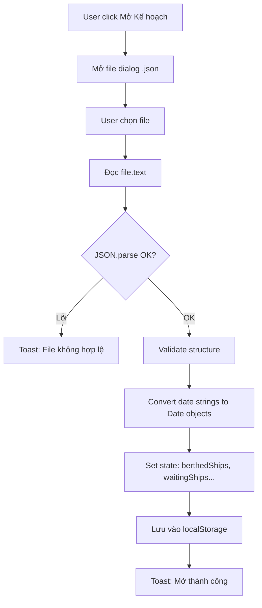

---

## State Persistence

Tất cả state quan trọng được lưu vào `localStorage` với key `berthPlannerState`:

```javascript
const savedState = {
  berthedShips: [...],
  waitingShips: [...],
  startDate: "2025-01-01T00:00:00",
  numDays: 7,
  cranePositions: [...],
  lastUpdated: "2025-01-01T12:00:00"
};
```

**Auto-save triggers:**
- Khi thay đổi berthedShips
- Khi thay đổi waitingShips
- Khi thay đổi startDate/numDays
- Khi di chuyển cẩu

---

*Tiếp theo: [03_DATA_MODEL.md](./03_DATA_MODEL.md)*
